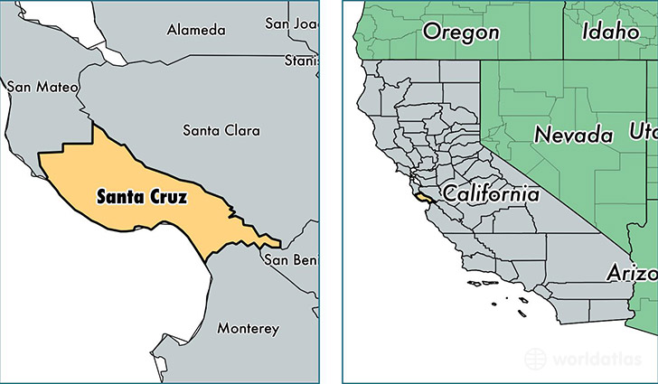

```{r setup, include=FALSE}
knitr::opts_chunk$set(echo = TRUE)
```

## ESM237 Assignment #1

### Introduction.

Santa Cruz is a coastal town located on the Northern edge of the Monterey Bay in California. It is largely urban, but is surrounded by coastline to the South, wooded hills to the North and East, and smaller neighboring towns. The climate is temperate and Mediterranean, with cool, wet winters and warm, dry summers. Summers are foggy, providing moisture for coastal redwood forests and other local ecosystems. The economy is Santa Cruz is partially dependent on tourism brought in by the natural resources, including beaches, word-class surfing, mountain biking, and hiking. The surrounding communities rely heavily on agriculture. The water supply for the City comes from mostly from a local reservoir that relies on local precipitation, but is also supplemented by a few wells and some small creeks. 



As the climate changes, some important impacts include changing precipitation amounts affecting rainfall, agriculture, and flooding; increased temperatures causing ecosystem harm, higher fire danger, and changing human behavior; and sea level rise which can cause coastal flooding and cliff erosion.

### Climate trends.

I conducted an analysis of one long-term climate dataset for Santa Cruz (Station name: SANTA CRUZ, CA US
; Network:ID GHCND:USC00047916) from [NOAA NCEI CDO](https://www.ncdc.noaa.gov/cdo-web/datatools/findstation) looking at temperature and precipitation trends from 1920 to 2019. In this report I will explore trends over this time period in average daily temperature, average yearly rainfall, and annual temperature extremes. 


```{r packages, include=FALSE}

library(tidyverse)
library(lubridate)
library(chron)
library(Kendall)

# load santa cruz climate data from NOAA NCEI CDO
# Station name: SANTA CRUZ, CA US
# Network:ID GHCND:USC00047916
# Lat/long: 36.98785, -121.99952 
# Elevation 21.3 m
# 1893-01-01 to 2020-04-10
# https://www.ncdc.noaa.gov/cdo-web/datatools/findstation

sc_climate_data <- read.csv("2102488.csv")


```

```{r tidying, include=FALSE}

sc_data_clean <- sc_climate_data %>% 
  select(DATE,PRCP,TMAX,TMIN) %>% 
  mutate(date=ymd(.$DATE)) %>% 
  filter(year(DATE)>1919) %>% 
  mutate(year= year(DATE)) %>% 
  mutate(month=month(DATE)) %>% 
  mutate(tavg=(TMAX+TMIN)/2) %>% 
  filter(year!=2020)


```


```{r exploratory, include=FALSE}

sc_tmax<- ggplot()+
  geom_point(data=sc_data_clean, aes(x=date, y=TMAX), color='magenta', alpha=0.2)+ 
  labs(y="Daily Max/Min Temperature (degrees C)", x="Date")+
  geom_point(data=sc_data_clean, aes(x=date, y=TMIN), color='turquoise', alpha=0.2)

sc_tmax
             
sc_rainfall <- ggplot(sc_data_clean, aes(x=date,y=PRCP))+
  geom_line()+ 
  labs(y="Daily Rainfall (mm)", x="Date")

sc_rainfall

```


```{r fill gaps, include=FALSE}

precip_avg <- sc_data_clean %>% 
  group_by(year(date)) %>% 
  select(PRCP) %>% 
  drop_na() %>% 
  summarize(precip=mean(PRCP))

mean(precip_avg$precip)
#0.0907668 mean daily precipitation of all given values
  

# fill in NA precip values with daily average over entire data period
fillrow = which(is.na(sc_data_clean$PRCP))
sc_data_clean$PRCP[fillrow]=0

# fill in NA temp values with average of before and after data
fillrow = which(is.na(sc_data_clean$TMAX))
fillrow = fillrow[2:length(fillrow)]
sc_data_clean$TMAX[fillrow]=(sc_data_clean$TMAX[fillrow+1]+sc_data_clean$TMAX[fillrow-1])/2

fillrow = which(is.na(sc_data_clean$TMIN))
fillrow = fillrow[2:length(fillrow)]
sc_data_clean$TMIN[fillrow]=(sc_data_clean$TMIN[fillrow+1]+sc_data_clean$TMIN[fillrow-1])/2


```


```{r aggregate precip, include=FALSE}

annualprecip <- sc_data_clean %>% 
  group_by (year) %>% 
  drop_na() %>% 
  summarize(precip=sum(PRCP)) %>% 
  filter(year!=2020)

# plot of annual rainfall totals

precip_plot <- ggplot(annualprecip, aes(x=year, y=precip))+
  geom_point()+
  labs(y="Annual Rainfall (inches)", x="Year")+
  theme_classic()+
  geom_smooth(method="lm")
precip_plot

# avg rainfall per year over the last 100 years is 31.2722 inches per year

# monthly rainfall.... too much work. 

monthlyprecip <- sc_data_clean %>% 
  group_by (year, month) %>% 
  drop_na() %>% 
  summarize(precip=sum(PRCP)) %>% 
  filter(year!=2020)

monthly_precip_plot <- ggplot(monthlyprecip, aes(x=precip))+
  geom_histogram()
monthly_precip_plot

mean(monthlyprecip$precip)

monthly_precip_low <- monthlyprecip %>% 
  ungroup() %>% 
  group_by(year) %>% 
  filter(precip>2.5) %>% 
  summarize(n=n())

# precip by month

monthyearprecip <- sc_data_clean %>% 
  group_by (year,month) %>% 
  drop_na() %>% 
  summarize(precip=sum(PRCP)) %>% 
  filter(year!=2020)

precipmy_plot <- ggplot(monthyearprecip, aes(x=year, y=precip))+
  geom_point()+
  labs(y="Annual Rainfall (inches)", x="Year")+
  theme_classic()+
  facet_wrap(~month)
precipmy_plot

dec_precip <- monthyearprecip %>% 
  filter(month==12)

```


```{r aggregate, include=FALSE}

# annual min and max temps
annualtemp_max <- sc_data_clean %>% 
  group_by (year) %>%
  drop_na() %>% 
  summarize(tmax=max(TMAX)) %>% 
  filter(year!=2011)

annualtemp_min <- sc_data_clean %>% 
  group_by (year) %>%
  drop_na() %>% 
  summarize(tmin=min(TMIN)) %>% 
  filter(year!=2011)

annualtemp_ext <- sc_data_clean %>% 
  group_by (year) %>%
  drop_na() %>% 
  summarize(tmax=max(TMAX),
            tmin=min(TMIN)) %>% 
  filter(year!=2011)
# plots of min and max extremes

extreme_temp <- ggplot(annualtemp_max, aes(x=year, y=tmax))+
  geom_point(color='firebrick2')+
  geom_point(data=annualtemp_min, aes(x=year, y=tmin), color='dodgerblue2')+
  labs(y="Temperature (degrees F)", x="Year")+
  theme_classic()

extreme_temp

maxtemp_plot <-ggplot(annualtemp_max, aes(x=year, y=tmax))+
  geom_point(color='firebrick2')+
  geom_smooth(method="lm")+
  labs(y="Temperature (degrees F)", x="Year")+
  theme_classic()
maxtemp_plot

mintemp_plot <-ggplot(annualtemp_min, aes(x=year, y=tmin))+
  geom_point(color='dodgerblue2')+
  geom_smooth(method="lm")+
  labs(y="Temperature (degrees F)", x="Year")+
  theme_classic()
mintemp_plot

# annual averages of temp
annualtemp_maxavg <- sc_data_clean %>% 
  group_by (year) %>%
  drop_na() %>% 
  summarize(tmaxavg=mean(TMAX))

annualtemp_minavg <- sc_data_clean %>% 
  group_by (year) %>%
  drop_na() %>% 
  summarize(tminavg=mean(TMIN))

# plots of average max and average min temps aggregated by year

avg_temp_maxmin <- ggplot(annualtemp_maxavg, aes(x=year, y=tmaxavg))+
  geom_point(color='firebrick2')+
  geom_point(data=annualtemp_minavg, aes(x=year, y=tminavg), color='dodgerblue2')

avg_temp_maxmin

# average daily temperature by month and year

avg_temp <- sc_data_clean %>% 
  group_by(year) %>% 
  drop_na() %>% 
  summarize(yearavg=mean(tavg))
  
  
avg_temp_plot <- ggplot(avg_temp,aes(x=year,y=yearavg))+
  geom_point()+
  labs(y="Annual Average Temperature (degrees F)", x="Year")+
  theme_classic()+
  geom_smooth(method="lm")

avg_temp_plot


```

```{r below freeze, include=FALSE}

freeze<- sc_data_clean %>% 
  mutate(freeze=case_when(TMIN<33~1,
                          TRUE~0)) %>% 
  group_by(year) %>% 
  summarize(freeze=sum(freeze))

ggplot(freeze,aes(x=year,y=freeze))+
  geom_point()

freezelm <- lm(freeze~year, data=freeze)
summary(freezelm)

# year         -0.14279    0.02901  -4.922 3.47e-06 ***

MannKendall(freeze$freeze)


```


```{r temp range, include=FALSE}

# find daily temperature range, then average per year

range <- sc_data_clean %>% 
  mutate(range=TMAX-TMIN) %>% 
  drop_na() %>% 
  group_by(year) %>% 
  summarize(range=mean(range))

rangeplot <- ggplot(range, aes(x=year, y=range))+
  geom_point()

rangeplot

## maybe also consider seasonally

range_seasonal <- sc_data_clean %>% 
  mutate(season = case_when(between(month,3,5) ~1,
                            between(month,6,8) ~2,
                            between(month,9,11) ~3,
                            TRUE~4)) %>%
  mutate(range=TMAX-TMIN) %>% 
  group_by(year,season) %>% 
  drop_na() %>% 
  summarize(range=mean(range))

# plot

rangeseasonplot <- ggplot(range_seasonal, aes(x=year, y=range, color=season))+
  geom_point()

rangeseasonplot 
  


```


```{r hottest day, include=FALSE}

# comparing date of hottest day each year... might be interesting... but it isn't
hottest_day <- sc_data_clean %>% 
  group_by(year) %>% 
  drop_na() %>% 
  mutate(tmax=max(TMAX)) %>% 
  ungroup() %>% 
  filter(TMAX==tmax) %>% 
  filter(year!=2020)

# plot

hottest_day_plot <- ggplot(hottest_day, aes(x=year,y=month, color=tmax))+
  geom_point()

hottest_day_plot

# number of hot days each year with max temp over 85
over85_days <- sc_data_clean %>% 
  mutate(over85= case_when(TMAX>85~1, TRUE~0)) %>%
  filter(year>1992) %>% 
  group_by(year) %>% 
  drop_na() %>% 
  summarize(over85=sum(over85))

ggplot(over85_days, aes(x=year,y=over85))+
  geom_point()

summary(lm(over85~year, data=over85_days))


over90_days <- sc_data_clean %>% 
  mutate(over90= case_when(TMAX>90~1, TRUE~0)) %>% 
  group_by(year) %>% 
  drop_na() %>% 
  summarize(over90=sum(over90))

ggplot(over90_days, aes(x=year,y=over90))+
  geom_point()

MannKendall(over90_days$over90)

```


```{r trends, include=FALSE}


# AVERAGES:
# average daily temp

# average yearly rainfall

# EXTREMES:
# max and min daily temperatures

# number of days each year above average 85 degrees


```


```{r statistical tests, include=FALSE}

# average daily temp
# test to see whether there is a significant increase in average daily temperature over the 100 year time span
# H0: avg daily temperature is not increasing significantly
# H1: avg daily temperatures is increasing significantly
# test: linear regression?


avgtemp_lm <- lm(yearavg~year, data=avg_temp)

summary(avgtemp_lm)

#             Estimate Std. Error t value Pr(>|t|)    
# (Intercept) 11.56885    8.80418   1.314    0.192    
# year         0.02317    0.00447   5.183 1.17e-06 ***

# based on the previous data, each year has an increase in avg daily temperature of about 0.02317 degrees

#maybe also try a Mann Kendall test?

library(Kendall)
MannKendall(avg_temp$yearavg)

# tau = 0.328, 2-sided pvalue =1.4305e-06


#######################

# split data into first 50 years and later 50 years and compare
old_avgtemp<- avg_temp %>%
  filter(year<1970)
recent_avgtemp <- avg_temp %>%
  filter(year >= 1970)

lm_old_avgtemp <- lm(yearavg~year, data=old_avgtemp)
summary(lm_old_avgtemp)
# Coefficients:
#             Estimate Std. Error t value Pr(>|t|)  
# (Intercept) 48.01872   24.47674   1.962   0.0556 .
# year         0.00443    0.01259   0.352   0.7264  
# ---
# Signif. codes:  0 ‘***’ 0.001 ‘**’ 0.01 ‘*’ 0.05 ‘.’ 0.1 ‘ ’ 1
# 
# Residual standard error: 1.284 on 48 degrees of freedom
# Multiple R-squared:  0.002574,	Adjusted R-squared:  -0.01821 
# F-statistic: 0.1239 on 1 and 48 DF,  p-value: 0.7264

lm_recent_avgtemp <- lm(yearavg~year, data=recent_avgtemp)
summary(lm_recent_avgtemp)

# Coefficients:
#              Estimate Std. Error t value Pr(>|t|)    
# (Intercept) -34.47399   24.38802  -1.414 0.163943    
# year          0.04624    0.01223   3.782 0.000431 ***
# ---
# Signif. codes:  0 ‘***’ 0.001 ‘**’ 0.01 ‘*’ 0.05 ‘.’ 0.1 ‘ ’ 1
# 
# Residual standard error: 1.248 on 48 degrees of freedom
# Multiple R-squared:  0.2296,	Adjusted R-squared:  0.2135 
# F-statistic:  14.3 on 1 and 48 DF,  p-value: 0.0004313

# t-test to compare the two periods

# are the means normally distributed? maybe... 
avgtemp_ttest <-t.test(old_avgtemp$yearavg,recent_avgtemp$yearavg)
avgtemp_ttest

# t = -4.1822, df = 97.034, p-value = 6.335e-05
# There is a signifcant difference in the means of avg temp in the first 50 years (before 1970) and the recent 50 years (1970 to 2019)


```


```{r precip statistical tests, include= FALSE}

# average yearly rainfall

# average yearly rainfall
# test to see whether there is a significant change in average daily temperature over the 100 year time span
# H0: avg daily temperature is not increasing significantly
# H1: avg daily temperatures is increasing significantly
# test: linear regression? Mann Kendall?

avgprecip_lm <- lm(precip~year, data=annualprecip)

summary(avgprecip_lm)

# Coefficients:
#             Estimate Std. Error t value Pr(>|t|)
# (Intercept) 68.00166   77.47451   0.878    0.382
# year        -0.01865    0.03933  -0.474    0.636
# 
# Residual standard error: 11.35 on 98 degrees of freedom
# Multiple R-squared:  0.002289,	Adjusted R-squared:  -0.007892 
# F-statistic: 0.2248 on 1 and 98 DF,  p-value: 0.6365

# not a significant linear relationship

# Mann Kendall test

MannKendall(annualprecip$precip)

# tau = -0.019, 2-sided pvalue =0.78181

# doesn't appear to be an overall trend in annual precipitation

old_precip<- annualprecip %>%
  filter(year<1970)
recent_precip <- annualprecip %>%
  filter(year >= 1970)


lm_old_precip <- lm(precip~year, data=old_precip)
summary(lm_old_precip)
# Coefficients:
#             Estimate Std. Error t value Pr(>|t|)
# (Intercept) 245.2582   217.7179   1.126    0.266
# year         -0.1099     0.1120  -0.981    0.331
# 
# Residual standard error: 11.42 on 48 degrees of freedom
# Multiple R-squared:  0.01966,	Adjusted R-squared:  -0.0007603 
# F-statistic: 0.9628 on 1 and 48 DF,  p-value: 0.3314
MannKendall(old_precip$precip)
# tau = -0.119, 2-sided pvalue =0.22515

lm_recent_precip <- lm(precip~year, data=recent_precip)
summary(lm_recent_precip)

MannKendall(recent_precip$precip)
# tau = 0.0882, 2-sided pvalue =0.37075

# no real significance in cumulative rainfall throughout the year 


# January rain
lm_dec<-lm(precip~year, data=dec_precip)
summary(lm_dec)


```


```{r temp extremes, include=FALSE}

# max  min daily temperatures

# test to see whether there is a significant change in average daily temperature over the 100 year time span
# H0: max temperature is not increasing significantly over the years 1920-2019
# H1: max temperature is increasing significantly
# test: linear regression? Mann Kendall?

tmax_lm <- lm(tmax~year, data=annualtemp_max)

summary(tmax_lm)
# Coefficients:
#              Estimate Std. Error t value Pr(>|t|)    
# (Intercept) 153.56040   33.20526   4.625 1.14e-05 ***
# year         -0.02851    0.01685  -1.692   0.0938 .  
# ---
# Signif. codes:  0 ‘***’ 0.001 ‘**’ 0.01 ‘*’ 0.05 ‘.’ 0.1 ‘ ’ 1
# 
# Residual standard error: 4.938 on 99 degrees of freedom
# Multiple R-squared:  0.0281,	Adjusted R-squared:  0.01829 
# F-statistic: 2.863 on 1 and 99 DF,  p-value: 0.09381

# not a significant linear trend

MannKendall(annualtemp_max$tmax)
# tau = -0.0816, 2-sided pvalue =0.2412

# not a significant relationship nonparametric...

# Split up into 50 year groups
old_tmax<- annualtemp_max %>%
  filter(year<1970)
recent_tmax <- annualtemp_max %>%
  filter(year >= 1970)

lm_old_tmax <- lm(tmax~year, data=old_tmax)
summary(lm_old_tmax)
# Coefficients:
#             Estimate Std. Error t value Pr(>|t|)
# (Intercept) 65.57945   72.98533   0.899    0.373
# year         c
# 
# Residual standard error: 3.83 on 48 degrees of freedom
# Multiple R-squared:  0.004089,	Adjusted R-squared:  -0.01666 
# F-statistic: 0.1971 on 1 and 48 DF,  p-value: 0.6591

lm_recent_tmax <- lm(tmax~year, data=recent_tmax)
summary(lm_recent_tmax)
# Coefficients:
#              Estimate Std. Error t value Pr(>|t|)   
# (Intercept) 299.37315  109.40013   2.736  0.00863 **
# year         -0.10154    0.05484  -1.852  0.07010 . 
# ---
# Signif. codes:  0 ‘***’ 0.001 ‘**’ 0.01 ‘*’ 0.05 ‘.’ 0.1 ‘ ’ 1
# 
# Residual standard error: 5.764 on 49 degrees of freedom
# Multiple R-squared:  0.0654,	Adjusted R-squared:  0.04632 
# F-statistic: 3.429 on 1 and 49 DF,  p-value: 0.0701

# overall no apparent trends in max temperatures


##############################
# minimum temperatures

tmin_lm <- lm(tmin~year, data=annualtemp_min)

summary(tmin_lm)
# Coefficients:
#              Estimate Std. Error t value Pr(>|t|)    
# (Intercept) -43.09167   19.81072  -2.175 0.031998 *  
# year          0.03595    0.01006   3.575 0.000544 ***
# ---
# Signif. codes:  0 ‘***’ 0.001 ‘**’ 0.01 ‘*’ 0.05 ‘.’ 0.1 ‘ ’ 1
# 
# Residual standard error: 2.946 on 99 degrees of freedom
# Multiple R-squared:  0.1143,	Adjusted R-squared:  0.1054 
# F-statistic: 12.78 on 1 and 99 DF,  p-value: 0.0005435

MannKendall(annualtemp_min$tmin)
# tau = 0.231, 2-sided pvalue =0.0010124

old_tmin<- annualtemp_min %>%
  filter(year<1970)
recent_tmin <- annualtemp_min %>%
  filter(year >= 1970)

lm_old_tmin <- lm(tmin~year, data=old_tmin)
summary(lm_old_tmin)
# Coefficients:
#              Estimate Std. Error t value Pr(>|t|)
# (Intercept) 33.076014  53.283775   0.621    0.538
# year        -0.003217   0.027402  -0.117    0.907
# 
# Residual standard error: 2.796 on 48 degrees of freedom
# Multiple R-squared:  0.0002871,	Adjusted R-squared:  -0.02054 
# F-statistic: 0.01379 on 1 and 48 DF,  p-value: 0.907
MannKendall(old_tmin$tmin)
# tau = -0.0379, 2-sided pvalue =0.71633


lm_recent_tmin <- lm(tmin~year, data=recent_tmin)
summary(lm_recent_tmin)
# Coefficients:
#               Estimate Std. Error t value Pr(>|t|)  
# (Intercept) -123.04827   57.53436  -2.139   0.0375 *
# year           0.07602    0.02884   2.636   0.0112 *
# ---
# Signif. codes:  0 ‘***’ 0.001 ‘**’ 0.01 ‘*’ 0.05 ‘.’ 0.1 ‘ ’ 1
# 
# Residual standard error: 3.031 on 49 degrees of freedom
# Multiple R-squared:  0.1242,	Adjusted R-squared:  0.1063 
# F-statistic: 6.948 on 1 and 49 DF,  p-value: 0.0112
MannKendall(recent_tmin$tmin)
# tau = 0.236, 2-sided pvalue =0.01861

```


```{r final plot avg, echo=FALSE}

avg_temp_plot

```

Figure 2. Average daily temperature aggregated as an average over each year in Santa Cruz. Trend line shown as linear model, with a slope of 0.02317 and p=1.17e-06.

```{r final plot precip, echo=FALSE}

precip_plot

```

Figure 3. Average annual rainfall in Santa Cruz from 1920-2019. Trend line shown is linear model of average annual rainfall over years, with a slope of -0.01865, p=0.636. Using a nonparametric Mann-Kendall test, the relationship between the variables is also not statistically significant (tau = -0.019, 2-sided pvalue =0.78181). 

```{r plot extremes, echo=FALSE}

extreme_temp

```

Figure 4. Annual maximum and minimum temperatures in Santa Cruz from 1920 to 2019. Red points show the maximum temperatures and blue points show minimum temperatures.

```{r max temp, echo=FALSE}

maxtemp_plot

```

Figure 5. Maximum annual temperatures in Santa Cruz from 1920 to 2019. The blue line shows a linear regression  with a slope of -0.02851, p=0.0938.

```{r mintemp, echo=FALSE}

mintemp_plot

```

Figure 6. Annual minimum temperature values in Santa Cruz from 1920 to 2019. The blue line is a linear regression fit to the data with slope of 0.03595, p=0.000544.

```{r month precip, echo=FALSE}
precipmy_plot


```

Figure 7. Average annual rainfall in inches, shown for each month from 1920 to 2019. The numerical values at the top of each scatterplot indicate the month.

### Discussion.

Average temperatures:

Based on this dataset, the average daily temperature aggregated over the entire year is increasing slightly over the 100 year time period, at a rate of, on average, about .02 degrees per year (figure 1). This is significant over time, as that equates to about 1 degree Farenheit of warming every 50 years, on average. If this trend continues into the future in the same way, this slight increase in air temperature could have effects on Santa Cruz. The warmer temperatures could change growing seasons, and crop yields in the agricultural sector. Increased evaporation could leave vegetated areas drier and more vulnerable to fire in the dry season, and could put strain on water resources for landscaping and in reservoirs. More in depth analysis could reveal information about timing of the onset of seasonality and other important factors.

Annual Precipitation:

This data suggests that while the annual rainfall appears to be decreased very slightly over the 100 year time period, it is not likely a trend outside of expected variability. This is important to note, because at this point there is no indication that climate has altered rainfall, based on the data trends. Even when the time span is split into the last 50 years, there is no apparent trend in the total amount of annual rainfall. Within this data, it is important to note that there is still year to year variability in the rainfall, and even looking further, there are no obvious trends for each month, looking over the 100 year time span (Figure 7). This information can be used to create water management plans looking into the future for residents, commercial businesses, and the agricultural sector. Perhaps there have been even more recent trends than the last 50 years, but that would be difficult to measure with a small sample considering the variability in year to year rainfall in the background data.

Precipitation changes in the area can have multiple effects. While unlikely to affect sea level, precipitation can incerase runoff from land and nutrient inputs into coastal ocean waters, leading to poor water quality and algal blooms. Coastal erosion may also be increased with added runoff and storm swells. For residents, changes in precipitation will affect water supply and usage, especially decreased precipitation, since the water supply is dependent on rain in the local reservoir. Water availability also impacts businesses and agriculture, especially if water availability decreases and the available supply must then be rationed between all of the local demand. 

Maximum annual temperature:

The maximum annual temperature does not appear to increase significantly over the long term (figure 5), but looking over the last 28 years, actually shows a more dramatic increasing trend. A linear regression model estimates that the number of days over 85 degrees has increased by 0.5446 per year, p=0.00767. This makes sense because while the last 100 years of temperature data provides an excellent baseline, the changes in climate that are being felt in the area would be more recent. However, it is also difficult to attribute trends in the shorter timescales to long term climate change, versus shorter term variation. This is an important factor to consider because more hot days can have a significant impact on many sectors. Being a relatively temperate location, many people do not have air conditioning systems in their houses, and more hot days could drive installation of these systems, adding extra draw on the electrical grid in Summer and Fall. Plants and crops may require more water, and some may experience excess temperature stress and be unable to survive, especially in the case that this trend continues into the future. 


Minimum annual temperature:

Based on my analysis, there appears to be a trend in the last 100 years of the minimum annual temperatures increasing over time (figure 6). From a linear regression, the minimum annual temperature is increasing by an average of 0.03595 degrees per year, p=0.000544. This data is important to consider especially for ecosystem health and for agriculture. Although currently temperatures reach below freezing less frequently than they did previously, based on a linear regression year with p=3.47e-06. This suggests that, although changes to maximum temperature are not apparent, with increasing average temperatures, minimum temperatures are increasing as well. Warmer minimum air temperatures may affect sea surface temperatures, soil temperatures, and other surfaces that would normally cool more during the coldest times of the year. Although not lkely to have large effects in the short term, this trend can continue into the future and have larger effects.

